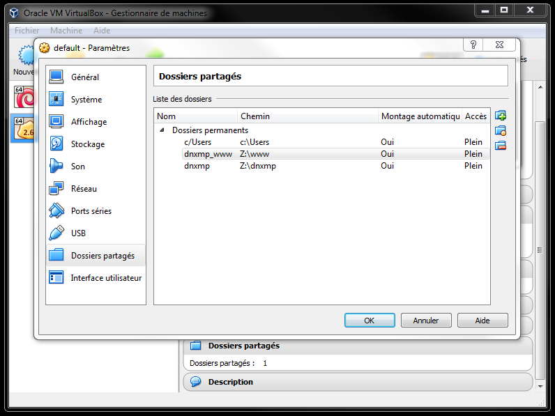

# DNXMP - Docker NginX MySQL PHP
**DNXMP** is a PHP-Development environment using Docker-compose.

This "**D**ocker" environment is a **N**gin**X**, **M**ySQL, **P**HP-FPM based server with PhpMyAdmin and Maildev.

Docker Composition :
- Nginx (image: nginx) - http://nginx.org/
- MySQL (image: mysql) - https://www.mysql.fr/
- PHP-FPM 7.0 (FROM php:7.0-fpm) - http://php.net/
    - PHP ext : iconv, json, mcrypt, mbstring, mysql(only php:5.6-fpm), mysqli, pdo_mysql, pdo_sqlite, phar, curl, ftp, hash, session, simplexml, tokenizer, xml, xmlrpc, zip, intl, gd, xdebu
    - Libraries : libfreetype6-dev, libjpeg62-turbo-dev, libmcrypt-dev, libpng12-dev, libsqlite3-dev, libssl-dev, libcurl3-dev, libxml2-dev, libzzip-dev, ssmtp, libicu-dev, g++
- PhpMyAdmin (image: phpmyadmin/phpmyadmin) - https://www.phpmyadmin.net/
- MailDev (image: djfarrelly/maildev) - http://danfarrelly.nyc/MailDev/

Default parameters:
- php:7.0-fpm (can be changed to php:5.6-fpm)
- remote host for Xdebug : **192.168.0.29**
- MySQL root password : **dnxmp**

Ports exposed:
- **80** : Nginx
- **3306** : MySQL
- **1080** : MailDev client
- **8080** : PhpMyAdmin

## Installation
DNXMP require docker and docker-compose.

First, run your docker terminal.

Then you will need to clone this repo :

```sh
$ git clone git@github.com:stayfi/dnxmp.git
$ cd dnxmp
```

You have to change the xdebug config "`remote_host`", in the file `docker-compose.yml` by your host IP address to have xdebug works:

``
16: XDEBUG_CONFIG: remote_host=YOUR_HOST_IP_ADDRESS
``

You have to add shared folders to your docker virtual machine, in Oracle VM Virtual Box :

- shared vm name "**dnxmp_root**" -> To the "root" of this repo

- shared vm name "**dnxmp_www**" -> To your "www" root



You have to add the "`bootlocal.sh`" file to your virtual machine in this folder "`/var/lib/boot2docker/`" :

```sh
$ docker-machine ssh default
* "(assuming 'default' is your docker virtual machine name)"
$ sudo vi /var/lib/boot2docker/bootlocal.sh
* "paste those lines into this new file:"
mkdir -p /home/docker/dnxmp/root
mount -t vboxsf dnxmp /home/docker/dnxmp/root
mkdir -p /home/docker/dnxmp/www
mount -t vboxsf dnxmp_www /home/docker/dnxmp/www

$ sudo chmod +x /var/lib/boot2docker/bootlocal.sh
```

Restart your docker machine (assuming "default" is your docker virtual machine name):
```sh
$ docker-machine restart default
```

If you update dockerfile, do a new build :
```sh
$ docker-compose build
```
This will compose the containers.

You can change the MySQL root password in the file `docker-compose.yml` :

``
32: MYSQL_ROOT_PASSWORD=dnxmp
``

You can work with php:5.6-fpm, juste change in in the file `docker-compose.yml` :

``
13:  image: stayfi/php56-fpm-dev
``

## Usage

Run dnxmp by :
```sh
$ docker-machine up
```
At the first run, it will pull images needed if it's not yet done, and generate the MySQL database.

Assuming your default docker IP address is 192.168.99.11, you can acces to :

##### Web server : http://192.168.99.100
To start working on your project.

##### PhpMyAdmin : http://192.168.99.100:8080
Web access to MySQL with the default credentials :
- root
- dnxmp

##### MailDev : http://192.168.99.100:1080
To check the mails sended by your PHP application, all mails are catched by Maildev.

##### MySQL : 192.168.99.100:3306
If you want to use another client for MySQL.

## Credits
Stayfi B. - <stayfi@gmail.com>

## Versions (Major.Minor[.Fix])

#### 1.2
Add link to image pre builded : stayfi/php70-fpm-dev

#### 1.1.1
Add php7.0-fpm
Fix tutorial in README.md

#### 1.1
Add link to image pre builded : stayfi/php56-fpm-dev

#### 1.0
First version, working.

## License
MIT license